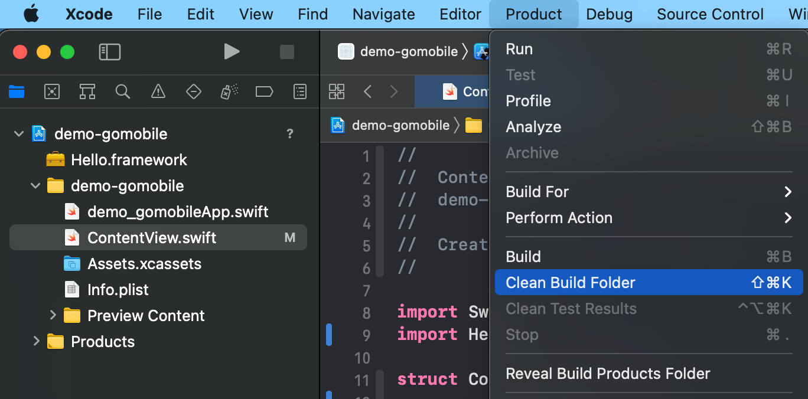
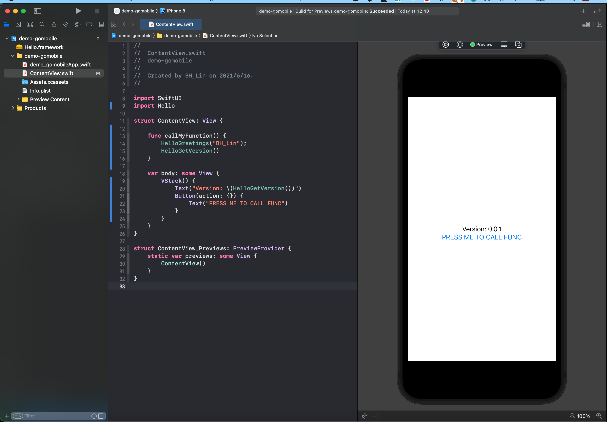

  
gomobile-bind-example
================================================

## How to replace the framework you build
- Please modify the code in folder "hello"  
- build iOS framework by following command 
```shellscript
cd hello; gomobile bind -target=ios
```
- Copy the Hello.framework you built to ios project 
```shellscript
rm -rf ../ios/Hello.framework; mv Hello.framework ../ios/Hello.framework
```

- Clean iOS project 

- Re-build iOS project 


then, you are good to go. 


